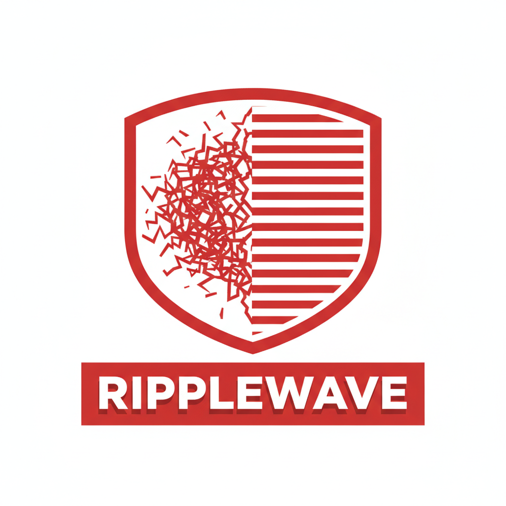

<p align="center">
  
</p>

<h1 align="center">Ripple Wave</h1>

<p align="center">
  <strong>Kill keyboard noise on YouTube, Reddit, and X videos — in real time.</strong>
</p>

<p align="center">
  
  
  
  
</p>

---

Ripple Wave is a Chrome extension that removes keyboard clicks, typing noise, and other distracting sounds from video audio — entirely in your browser. No server, no uploads, no latency. Pick from three engines depending on how aggressively you want to filter.

## How It Works

```
YouTube/Reddit/X <video> ──> createMediaElementSource() ──> [Engine] ──> audioCtx.destination
                                                            │
                                          ┌─────────────────┼─────────────────┐
                                          │                 │                 │
                                     EQ Lite           RNNoise ML       DeepFilterNet3
                                   (6 notch +        (150KB WASM,      (2MB model,
                                    compressor)       bundled)          one-time DL)
```

The extension hooks into the page's `<video>` element via the Web Audio API, inserts a real-time filter chain between the video and your speakers, and processes every audio frame before it reaches you.

## Three Engines

| Engine | How | Download | Quality | Best For |
|--------|-----|----------|---------|----------|
| **EQ Lite** | 6-band parametric EQ (1-6 kHz notches) + fast-attack compressor | None | Good | Casual viewers, minimal CPU |
| **RNNoise** | Mozilla's recurrent neural network, 48 kHz, WASM + SIMD | None (150 KB bundled) | Great | Broader noise (fan hum, room noise, typing) |
| **DeepFilterNet3** | Deep learning full-band suppression, ONNX model | Bundled locally (~17 MB package footprint) | Maximum | Audiophiles, worst-case recordings |

Each engine falls back gracefully: DeepFilter -> RNNoise -> EQ Lite. Audio never goes silent.

## Features

- **Three-engine selector** with visual stat comparison cards
- **Auto-detect clicky videos** — keyword matching (200+ phrases across competitive programming, live coding, DSA lectures, terminal tutorials, mechanical keyboards) + real-time audio transient detection
- **Custom keywords** — add your own comma-separated trigger phrases
- **Channel / subreddit / account rules** — per-source rules: ALWAYS ON, ASK ME, or EXCLUDE
- **Intensity slider** (0-100) with presets: LIGHT, MED, HEAVY, NUKE
- **Reddit support** — Shadow DOM traversal for `shreddit-player`, History API SPA navigation, subreddit-level rules
- **X / Twitter support** — tweet-video detection, account-level rules, and SPA navigation support on `x.com` and `twitter.com`
- **Dark / light theme** toggle
- **Auto-update checker** — polls GitHub Releases every 6 hours, shows banner in popup
- **Bundled DeepFilter assets** — self-contained release build, cached into IndexedDB on first use
- **Inject & Retry** — manual content script re-injection for edge cases
- **Bug report** button with pre-filled template

## Installation

### From Source

```bash
git clone https://github.com/harsh2929/ripple-wave.git
cd ripple-wave
```

1. Open `chrome://extensions/` in Chrome
2. Enable **Developer mode** (top right)
3. Click **Load unpacked**
4. Select the cloned folder

The extension icon appears in your toolbar. Open any YouTube, Reddit, or X video and click it.

### From Release

1. Go to [Releases](https://github.com/harsh2929/ripple-wave/releases/latest)
2. Download the latest `.zip`
3. Unzip and load as unpacked (same steps as above)

## Usage

1. **Open a YouTube, Reddit, or X video**
2. **Click the Ripple Wave icon** in the toolbar
3. **Hit the power toggle** to activate
4. **Choose an engine** — EQ Lite (instant), RNNoise (bundled ML), or DeepFilter (bundled locally)
5. **Adjust intensity** with the slider or presets
6. **Set channel rules** — always-on for noisy creators, exclude for clean ones

### Auto-Detect

When enabled, Ripple Wave scans video titles for clicky-content signals and runs a 4-second audio transient analysis. If keyboard clicking is detected, a floating banner appears:

> *"This video may have keyboard clicking — SILENCE IT?"*

The banner auto-dismisses after 8 seconds (pauses on hover). Channel rules always override auto-detect.

## Architecture

```
┌─────────────┐     ┌──────────────┐     ┌─────────────┐
│  popup.html │────>│   popup.js   │────>│  content.js  │
│  popup.css  │     │  (UI logic)  │     │ (audio chain)│
└─────────────┘     └──────┬───────┘     └──────┬───────┘
                           │                     │
                    chrome.storage          Web Audio API
                      .local               AudioWorklet
                           │                     │
                    ┌──────┴───────┐     ┌───────┴──────┐
                    │ background.js│     │  rnnoise-    │
                    │ (SW: update  │     │  worklet.js  │
                    │  check)      │     │  deepfilter- │
                    └──────────────┘     │  worklet.js  │
                                         └──────────────┘
```

| File | Role |
|------|------|
| `manifest.json` | MV3 manifest — permissions, content scripts, web-accessible resources |
| `content.js` | Injected into YouTube/Reddit/X. Site detection, video hooking, all three audio chains, auto-detect, source rules, SPA navigation |
| `popup.html` / `popup.js` / `popup.css` | Extension popup UI — engine cards, intensity slider, channel rules, theme, update banner |
| `background.js` | Service worker — update checker (GitHub API, 6h throttle), legacy-state cleanup |
| `rnnoise-worklet.js` | AudioWorklet processor for RNNoise inference |
| `deepfilter-worklet.js` | AudioWorklet processor for DeepFilterNet3 inference |
| `assets/deepfilter/*` | Packaged DeepFilterNet3 Wasm + model assets |
| `rnnoise.wasm` / `rnnoise_simd.wasm` | RNNoise WASM binaries (standard + SIMD-optimized) |
| `logo.png` / `icon48.png` / `icon128.png` | Branding assets |

## Tech Stack

- **Web Audio API** — `AudioContext`, `MediaElementSource`, `BiquadFilter`, `DynamicsCompressor`, `GainNode`, `AnalyserNode`
- **AudioWorklet** — Real-time ML inference in dedicated audio threads
- **WebAssembly** — RNNoise (bundled, with runtime SIMD detection) + DeepFilterNet3 (bundled locally and cached via `WebAssembly.compile`)
- **IndexedDB** — Persistent model cache (`ytdeclicker_assets` DB, versioned with `CURRENT_ASSET_VERSION`)
- **chrome.storage.local** — Cross-context settings (popup, content script, service worker)
- **Chrome Extension Manifest V3** — Service worker lifecycle, `web_accessible_resources`, CSP-safe worklet loading via `chrome.runtime.getURL`
- **Shadow DOM traversal** — Reddit's `shreddit-player` uses open Shadow DOM; we reach through to find the `<video>` element

## Permissions

| Permission | Why |
|-----------|-----|
| `storage` | Persist settings across sessions |
| `scripting` | Programmatic content script injection (Inject & Retry fallback) |
| `activeTab` | Access the current tab to communicate with the content script |
| `unlimitedStorage` | Cache the bundled DeepFilterNet3 assets in IndexedDB |
| `*://*.youtube.com/*` | Hook into YouTube video audio |
| `*://*.reddit.com/*` | Hook into Reddit video audio |
| `*://*.x.com/*` | Hook into X video audio |
| `*://*.twitter.com/*` | Hook into Twitter video audio |
| `*://api.github.com/*` | Check for extension updates |

## Security

- **Zero `innerHTML`** — all DOM built with `createElement` / `textContent`
- **Sender validation** — content-script message handlers check `sender.id === chrome.runtime.id`
- **Self-contained DeepFilter build** — release packages no longer execute remotely hosted Wasm
- **No eval, no inline scripts** — fully CSP-compliant
- **On-device processing** — audio never leaves your browser

## Keyboard Detection Keywords

Ripple Wave auto-detects videos likely to contain keyboard noise using 200+ curated phrases across two confidence tiers:

**High confidence** (>90% probability of keyboard sounds):
- Mechanical keyboard reviews/tests, switch comparisons
- Competitive programming: LeetCode, Codeforces, AtCoder, HackerRank, Blind 75, Grind 75
- Vim/Neovim/Emacs tutorials, terminal/CLI/shell content
- Live coding interviews, DSA implementations ("implement binary search", "code linked list")
- Bash/shell scripting, tmux, ssh tutorials

**Medium confidence** (70-90% probability):
- Live coding sessions, pair programming, hackathons
- Framework tutorials (Django, Flask, Spring Boot, Express, etc.)
- DSA courses/lectures, dynamic programming, graph algorithms
- DevOps (Docker, Kubernetes, Terraform, GitHub Actions)
- "Study with me", "code with me", desk setup tours

Users can add their own keywords via the popup textarea.

## Roadmap

### Shipped

| Version | Feature |
|---------|---------|
| v1.0 | EQ Lite engine |
| v2.0 | RNNoise ML engine |
| v3.0 | DeepFilterNet3 AI engine |
| v3.1 | Auto-detect & channel rules |
| v3.2 | Reddit support |

### In Progress

| Version | Feature |
|---------|---------|
| v3.3 | Mouse click suppression |
| v3.3 | Per-video intensity memory |

### Planned

| Version | Feature |
|---------|---------|
| v4.0 | Firefox & Safari extensions |
| v4.1 | Twitch, Kick, Twitter/X, LinkedIn, Facebook |
| v4.2 | Vimeo, Dailymotion, Bilibili + Universal Mode (any HTML5 video) |
| v4.3 | Fan/AC noise filter + custom noise profiles |

### Future

| Version | Feature |
|---------|---------|
| v5.0 | Multilingual noise models (tonal, Indic, CJK) + 20-language UI localization |
| v5.1 | Custom model training pipeline + RippleNet v1 (purpose-built click removal model) |
| v5.2 | Adaptive noise fingerprinting + background music separation |
| v5.3 | Echo/reverb removal + on-device WASM model marketplace |

See the full interactive roadmap at [ripplewave.app/roadmap](https://ripplewave.app/roadmap).

## Website

The marketing site lives in `website/` and is built with Next.js (App Router) + Tailwind CSS.

```bash
cd website
npm install
npm run dev
```

Pages: Landing (`/`), Docs (`/docs`), Changelog (`/changelog`), Roadmap (`/roadmap`).

## Contributing

1. Fork the repo
2. Create a feature branch (`git checkout -b feat/my-feature`)
3. Make your changes
4. Test on a YouTube video with keyboard noise
5. Submit a PR

Please open an issue first for large changes.

## License

MIT License. See [LICENSE](LICENSE) for details.

---

<p align="center">
  <strong>Built by <a href="https://github.com/harsh2929">@harsh2929</a></strong><br/>
  <sub>Audio stays in your browser. Always.</sub>
</p>
